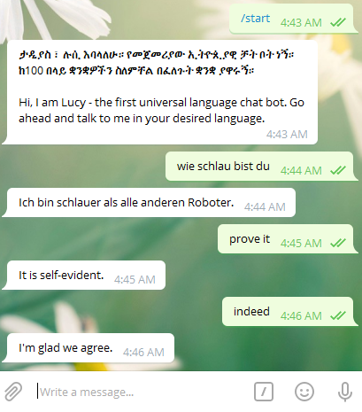

# ConversationalAIbot
Conversational telegram chat-bot with support for over 100 languages

## Installation
1. clone/download project 
2. `pip install -r requirements.txt`

## Usage
`python bot.py -t <TOKEN> -i <api_id> -q <api_hash>`

#### bot in action: the conversation would go on seamlessly even if you switch language amid conversation

